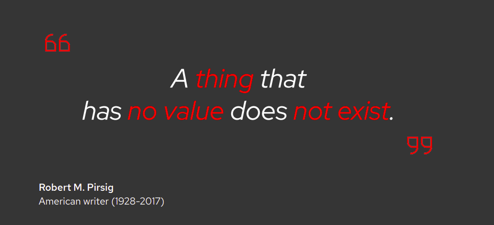
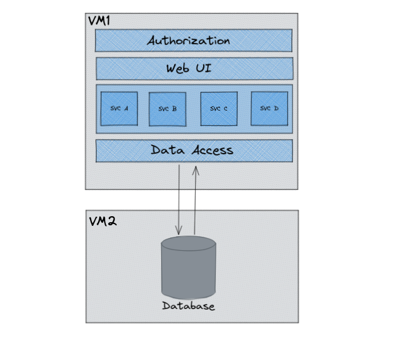

# :rocket: Transitioning to Microservices: A Journey from Mono to Micro

In recent times, microservices have become a global trend. There are several advantages offered by the microservices, such as better scalability, flexibility, agility, and more. The shift from a monolithic architecture to microservices (Google, Amazon, Netflix microservices architecture) was implemented by several tech leaders. The following example is considered by many businesses to choose the most effective way to grow.

Monolithic applications are the default approach for developing software. Despite this trend, monolithic applications are declining in popularity since they are notoriously difficult to build because of multiple problems such as handling a huge codebase, implementing new technology, scaling, and deploying. Thus, at some moment, you may need to start looking for application modernization services.

It is worth looking at how the architectural style came about and how a monolith tends to evolve into an MOA. You can use this historical overview as a guide for designing an MOA. So let's start by taking a short walk down IT's memory lane.

# :tanabata_tree: The roots of Microservices application design

### :clock4: How we used to build applications

The Monolithic application describes a single-tiered software application in which different components combined into a single program from a single platform

Take a look at Figure, which illustrates a typical monolithic application.

Notice that everything the application needs is within the boundary of the application. The original monolithic application had the web and application servers, business functions, and database all on one system.

There were some flaws that  can be seen here :

- Any non-trivial **change to a component causes a chain reaction**, it causes changes in the rest of the components, **bringing down the whole application** along with it.

- Over time, as more applications appeared, **the database became a resource hog, eating up all the memory and compute capacity of the host machine**. 

- **Scalability needs to be applied to the application as a whole**, and many times, scalability simply implies upgrading the underlying hardware. There is **hardly any way to scale up only a part of the application.**
  

### :fast_forward: Era of Tiered Architecture

The first step in relieving the burden of the monolith on the underlying system is to move the database into a separate system.

However, over time, just moving the database to its own machine wasn't enough. Similar to the database now the application logic started to push the limits of the host's computing capacity.

To overcome this issue architects implemented a **multiple instance design** in which **many computers hosting identical business logic** were put behind a load balancer. The load balancer routed traffic optimally so as not to overpower any one machine with each computer hosting business logic stored data on a central database.

**To scale** better, the **monolithic application is simply replicated on multiple systems**, all talking to the database. Replicating identical business logic across many machines had its benefits.

**But**.......  Few of problems still persisted:

- Replication across many machines also **created a big problem for maintenance and upgrades**.

- **Adding a new feature** to the business logic or **changing the data schema** in the database is still a significant chore.

- Scalability was still an issue. There was **no way to scale an individual application or service**. As it turns out that replicating the monolithic application is not the solution to scaling that developers had hoped for. 

## :star2: Digital Transformation 

**We have to change the way to build and deliver applications.**

Digital transformation is the integration of digital technology into all areas
of a business, fundamentally changing how you operate and deliver value to
customers. It’s also a cultural change that requires organizations to
continually challenge the status quo, experiment, and get comfortable
with failure.

### And you do know what is going to happen if you do nothing...

#### It’s about efficiency, agility, & speed

### :cyclone: The SOA Version

The design shown in the below diagram or its variant is used in order to work around the drawbacks of the tightly coupled monolith design. It’s called SOA – Service Oriented Architecture. 

Here in SOA, we have REST API services – Product service, Order service, and Customer service instead of the Assemblies. Each service is an independent component that can run on its own. It can be developed and tested independently. It exposes a well-defined interface to its users. 

The UI in an SOA is lightweight with only views and rendering logic and a few validations. The UI calls the services using REST. 

If the services in an SOA need to communicate with each other, they use REST API calls or some other means. The principle is to **use advertised public interfaces or API endpoints for communication**, and not depend on the internals of the implementation of any service.

Services can co-exist on a single server or can be spread across servers, depending on the traffic. Since **each service is an independent unit** of implementation and deployment, it can follow its own release cycle. **Each service can be scaled up or down** depending on the traffic visiting the service.

Despite all the above advantages, there is one small pitfall – **the database is common!** SOA principles ask for services with explicit boundaries, but there is **no explicit restriction on data sharing**. This often leads to various services sharing a database.

It can lead to issues like  

- Concurrent, asynchronous updates by different services
- Race for connections
- DB schema change impacts all services
- Whole DB needs to scale up – we can’t scale up only product data in order to speed up the product searches.

Also, the **SOA doesn’t limit the size of a service**. This often leads to services turning into **miniature monoliths**. It can take up too many responsibilities resulting in performance issues. Fixing performance issues of a monolith service requires re-design or split of the service into two or more services. 

But instead of redesigning it, often a quick solution is to give more resources to the service which means the real problem remains untouched while a superficial solution is applied and this is not what developers had hoped for. That is why they finally turned to microservices.

## :crown: Finally Microservices, the king

The term "**Microservice Architecture**" has sprung up over the last few years to describe a particular way of designing software applications as suites of independently deployable services.

Here, we see multiple services – Product, Customer, and Order services. Each service has its own database. The size of each service is such that it serves one small purpose in a cohesive way. 

The UI is interacting with the services using an API gateway, which is another service responsible for connecting other services to the UI. 

The services are communicating with each other using the Event Hub.

### [:memo:](https://developers.redhat.com/articles/2022/01/11/5-design-principles-microservices#five_design_principles_for_microservices) **Five design principles for microservices** 

The benefits of an MOA can be significant, but they come with a price. You need to know a thing or two about microservice design to implement an MOA effectively—you can't make it up as you go along. A microservice application must follow these five principles:

- **Single concern:** microservice should do one thing and one thing only
- **Discrete:** all logic and data relevant to a microservice's single concern must be encapsulated into a single deployment unit.
- **Transportable:** can be moved from one runtime environment to another with little effort
- **Carries its own data:** should have its own data storage mechanism that is isolated from all other microservices.
- **Inherently ephemeral:** means that it can be created, destroyed, and replenished on-demand on a target easily, quickly, and with no side effects.

